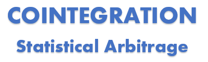

----

  

Cointegration spread trading is a statistical arbitrage strategy for trading financial assets. You basicially trade two cointegrated assets, that is two assets that have the same price fluctuations and long term movement. 

But when they once in a while move apart from each they tend to revert back to the mean at some point. It's that knowledge you can use to your advantage.
Practically you buy one af the assets and sell the other, This way you can remove the risk of being affected by the general market movements, which is a huge advantage. 
Read more about the process in notebook

Quantconnetc code and backtestreport:
https://www.quantconnect.com/terminal/processCache?request=embedded_backtest_1c93e92fbb296bfd7b1d2110077f9550.html

*Note: There seems to be some differences between the optimal paramters calculated and the optimal parameters for backtest. This is an issue I'm pursueing at the moment. Project will be opdated with my findings.*

<!--stackedit_data:
eyJoaXN0b3J5IjpbLTU0Mjg0MzIxOCwxNzcxOTAzMDgxLDIwMD
M4Njg2NTMsMTI5MTk3MzAyLDE4NTU2NDk4OTcsMTMzOTU1NzE3
MywxOTY3OTI3NTU0LDExMzM1OTA3ODIsLTE0MzM3OTgwNzEsLT
EzMTM0MzgxNjIsNDU4NDYyOTcyLC0xMDAzMDgwNjEyLC0zNjgx
ODQxMjhdfQ==
-->
