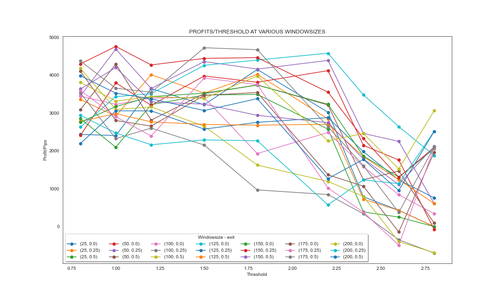
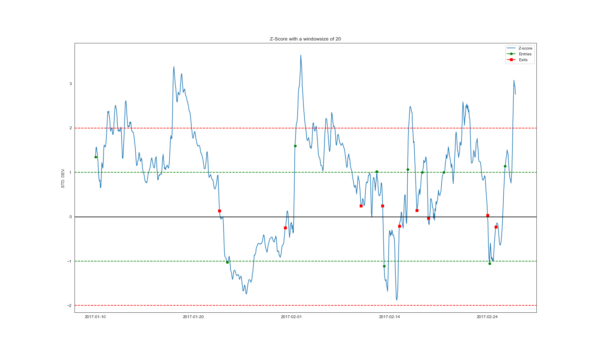

----

  

Note! Repository is being updated at the moment

#### Introduction
Cointegration spread trading is a statistical arbitrage strategy for trading financial assets. You basicially trade two cointegrated assets, that is two assets that have the same price fluctuations and long term movement. But when they once in a while move apart from each they tend to revert back to the mean at some point. It's that knowledge you can use to your advantage.
Practically you buy one af the assets and sell the other, This way you can remove the risk of being affected by the general market movements, which is a huge advantage. 

In the past it was possible to use mean-reverting strategies to trade assets and you could be profitable. But as with most all trading strategies, as they are used by more and more people they loose their edge and stops being profitable. I don't expect this strategy to be higly profitable.

#### Goal
I want to investigate if using a mean-reverting strategy using cointegration can give any information about price movements in the traded assets. Any information we can derive from this strategy can be used as an factor in another larger model.

#### Conclusion
So far it hasn't been possible to get much edge in this strategy. That is, the different factors like Sharpe ratio and profit hasn't bee significant enough to prove that we can derive any useful information or edge in this strategy. There is however room for more investigation as it migt be possible to improve the strategy.
When running a second backtest (on the second testset from 2021). I got a profit of 3.6% over the year and the model has a Sharpe ratio of 0.472. This result isn't good but it's also not bad as there is room for further improvements.

#### Challenges faced
In the first attempts to find the optimal entry and exit thresholds there was a problem with the thresholds being overfittet to the training dataset. Becasue as I testet the thresholds on our first testset (2020) the results were horrible. I investigated it and it turned out that the training set didn't fully reflect the parameters of the population. The original trainingset was on hourly data from 2016 to 2019 and it showed the best results with a windowsize of only 20. When I expanded the trainingset to hourly from 2010 to 2019 I got a windowsize of 150. The reason for not including data from 2010 in the first dataset is because, when you deal with financial assets they change over time. So if you want to predict future pricemovements you want your model to put it's emphasis on the latest data and preferably remove older data as it might skew you model.
---

*Models with all the different parameters of windowsize, entry and exit thresholds are run and visualized*

---

*Visualization of two months with trades based on the optimal parameters*

The notebook has a lot of comments to let you understnad the code and my process.

#### Backtest and production
Although I didn't put this model into production, ie. let it trade on the markets, it would be possible with the code I used to backtest it. You can wast the backtestreport, visualizations an code in the link below.
Quantconnetc code and backtestreport: 
https://www.quantconnect.com/terminal/processCache?request=embedded_backtest_905cedf89d97241c80b91e4301658356.html

<!--stackedit_data:
eyJoaXN0b3J5IjpbLTQ3NTEyMDY5NiwtMTUxMTg0OTEzNyw1NT
c2NzQ0MDAsMTQ1NjUzODU0NiwtMTQ5OTUyNTI3Nyw1MjY1OTk0
NTQsLTU0Mjg0MzIxOCwxNzcxOTAzMDgxLDIwMDM4Njg2NTMsMT
I5MTk3MzAyLDE4NTU2NDk4OTcsMTMzOTU1NzE3MywxOTY3OTI3
NTU0LDExMzM1OTA3ODIsLTE0MzM3OTgwNzEsLTEzMTM0MzgxNj
IsNDU4NDYyOTcyLC0xMDAzMDgwNjEyLC0zNjgxODQxMjhdfQ==

-->